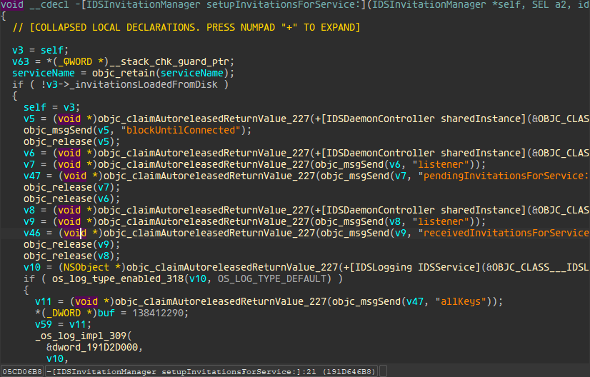
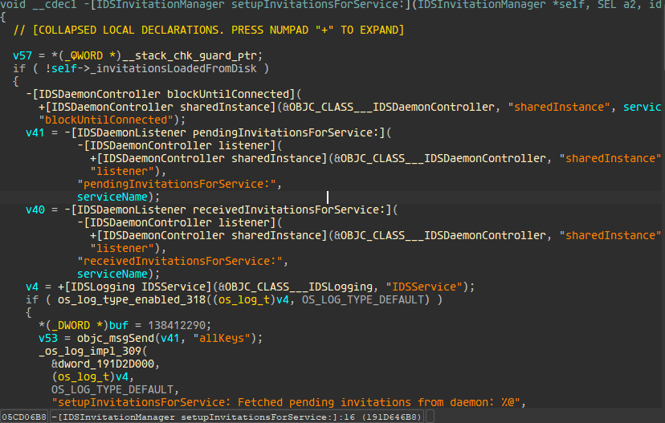

# ida_objCleaner
Hides ObjC ARC runtime functions temporarily in IDA's pseudocode so IDA can propagate the types correctly. Tested on iOS 18's dyld_shared_cache and binaries.

Plugin is disabled by default. Press `Ctrl-Alt-E` or `Edit->Plugins->Show/Hide ObjC ARC runtime` to enable/disable the optimiser.

**Before:**

**After:**

## Installation
Copy `ObjCleaner.py` to your IDA Plugin directory.